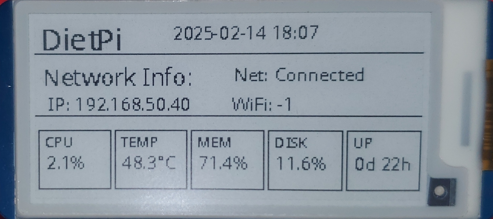

# E-Paper System Statistics Display

A Python-based system monitoring tool designed for Waveshare 2.13inch V4 E-Paper display, perfect for Raspberry Pi and other single-board computers. Display real-time system statistics including CPU usage, temperature, memory, disk usage, network status, and more.

 <!-- You'll need to add your own image -->

## Features

- Real-time system statistics monitoring
- Network status and WiFi signal strength
- System metrics (CPU, Memory, Disk usage, Temperature)
- Efficient display updates with partial refresh technology
- Automatic full refresh cycling to prevent display ghosting
- Robust error handling and recovery
- Clean shutdown handling

## Hardware Requirements

- Waveshare 2.13inch V4 E-Paper Display
- Raspberry Pi (or compatible single-board computer)
- Compatible operating system (Tested on Raspberry Pi OS, DietPi)

## Software Prerequisites

```bash
# System packages
sudo apt-get update
sudo apt-get install -y python3-pip python3-pil python3-numpy git

# Python packages
pip3 install RPi.GPIO spidev pillow psutil
```

## Installation

1. Clone the repository:
```bash
git clone https://github.com/yourusername/epaper-stats.git
cd epaper-stats
```

2. Install required Python packages:
```bash
pip3 install -r requirements.txt
```

3. Enable SPI interface (if not already enabled):
```bash
sudo raspi-config
# Navigate to Interface Options -> SPI -> Enable
```

## Usage

Run the script:
```bash
python3 epaper-stat.py
```

To run as a service:
```bash
sudo cp systemd/epaper-stats.service /etc/systemd/system/
sudo systemctl enable epaper-stats
sudo systemctl start epaper-stats
```

## Configuration

The script includes several configurable parameters in the `SystemMonitor` class:

- `FULL_REFRESH_INTERVAL`: Number of updates before performing a full refresh
- `UPDATE_INTERVAL`: Time between updates (in seconds)
- `MAX_RETRY_ATTEMPTS`: Maximum number of retry attempts for failed updates
- `RETRY_DELAY`: Delay between retry attempts (in seconds)
